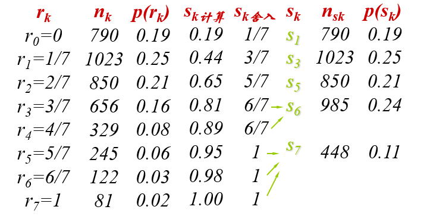
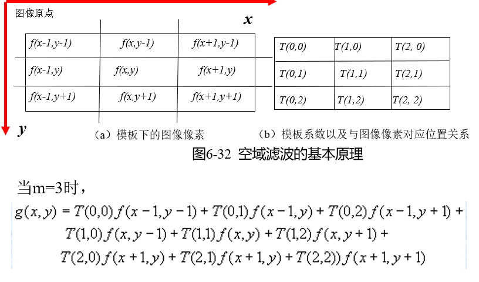
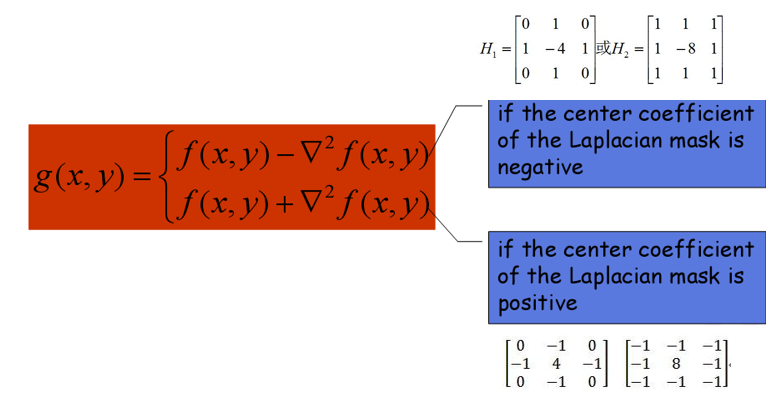

# 1. 绪论

## **什么是连续图像？**

­定义为二维函数f(x,y),其中，x,y是空间坐标，f(x,y)是点（x,y）的幅值

­灰度图像是一个二维灰度（或亮度）函数f(x,y)

­彩色图像由三个（如RGB,HSV）二维灰度（或亮度）函数(x,y)组成

## **什么是数字图像？**

**什么是数字图像？**

­**像素组成的二维排列，可以用矩阵表示**

­**单色（灰度）图像**：每个像素的亮度用一个数值来表示，通常数值范围在0到255之间，0表示黑、**255**表示白，其它值表示处于黑白之间的灰度

­**彩色图像：****可以用红、绿、蓝三元组的二维矩阵来表示。**

­**通常，三元组的每个数值也是在**0到255**之间，0表示相应的基色在该像素中没有，而**255则代表相应的基色在该像素中取得最大值


­彩色图像，又称为“多光谱图像”

图像上的每个点有多于一个的局部特征。

- ­彩色电视中重现的三基色图像，每个像素点就需要有红、绿、蓝三个基色的三个亮度值表示。

- ­遥感图像可以提供多达7个不同通道的信息。

­黑白图像，又称“灰度图像”、“亮度图像”、“单色图像”等，

- 每个像素点只有一个亮度值。


# 数字图像基础

韦伯定律：对于一个目标来说，如果背景亮度均匀而且足够大，则在一定亮度范围内，能够从背景中区别目标的最小亮度差ΔI与背景的亮度I成正比：ΔI/ I = C；

二值图像：是一种黑白图像，用1表示黑色，用0表示白色，每个像素只需要一个bit

非二值图像：一般用矩阵表示，如果是灰度图，f为灰度，如果是彩色，一般用RGB三个矩阵表示，各个8bit

当一副图像有2k级灰度时，通常称该图像为k位图像。如256级灰度图像就叫8位图像。

**空间分辨率：**一副图像中可分辨的最小细节，或单位距离可分辨的最少数目的线对。主要由采样决定

**灰度分辨率：**可察觉的最小灰度变化（主观的），主要由量化所决定。


BMP格式是Microsoft公司为其windows环境开发的标准图像格式，是一种与设备无关的点阵位图文件格式。虽然大部分BMP文件是不压缩的形式，其本身还是支持图像压缩的，如rle ( run length encoding)格式和LZW压缩格式等

BMP是BitMap Pixel是缩写，意思是对数字图像每个像素，均列出每一位。国内翻译成位图。基本上它是一种非压缩图像格式。

BMP 图像文件的结构可分为三部分：文件头、位图信息头和图像数据。


# 图像增强

**突出一幅图像中的某些信息，同时，削弱或去除某些不需要的信息的方法。**

空间域处理

- 全局运算：在整个图象空间域进行。
- 局部运算：在与象素有关的空间域进行。
- 点运算：对图象作逐点运算。


## 基础

空域增强的一般数学表达式：

g(x,y) = T(f(x,y))

算子T操作在(x,y)的某个邻域上，例如3×3邻域.

当更大的邻域被考虑时，往往成为**掩码处理**(mask processing)或者**滤波**。


### 灰度变化

反转变化

对数变换

幂律变换

```
算法：灰度变换
输入：fi[x,y]
输出：fo[x,y]
Procedure GreyTransfomation( fi, fo)
{
    for i:=0 to L-1                       //计算灰度变换索引
       index[i] = T(i)；
    for y:=0 to MaxRow-1         //对图像进行扫描
       for x:=0 to MaxCol-1
          fo(x,y) = index[fi(x,y)];
}
```


### gamma矫正

数字图像信息的获取来自于CCD图像传感器，但是CCD的输入输出特性不是线性的。

设CCD的输入（入射光强度）为r，输出（电流强度）为S，则有：

S = C*r^γ^

r=(S/C)^1/γ^

```
算法：图像的r校正
输入：fi[x,y]
输出：fo[x,y]
Procedure GamaCorrection ( fi, fo)
{
    for i=0 to L-1                         //计算灰度变换索引
       index[i] = ；//r=(S/C)^1/γ^
    for y:=0 to MaxRow-1       //对图像进行扫描
       for x:=0 to MaxCol-1
          fo[x,y] = index[fi(x,y)];
}

```

### 线性变换

当图象成象时曝光不足或过度, 或由于成象设备的非线性和图象记录设备动态范围太窄等因素。都会产生对比度不足的弊病，使图象中的细节分辨不清。这时可将灰度范围线性扩展。

设f(x,y)灰度范围为[a,b]，g(x,y)灰度范围为[c,d],

然后三个区间对应不同的变换

分段性的灰度变换：讲感兴趣的灰度范围扩展，相对抑制不感兴趣的灰度区域

### 位平面切割

额，就是把8个bit的值一个一个分出来

## 直方图处理

直方图描述了每个灰度级具有的像素的个数，反映的是图像灰度的统计信息，但**丢失了所有这些像素点的空间信息**，即像素点的相对位置。因此，任一特定的图像有唯一的直方图，但反之并不成立。

直方图是大量的空域处理技术的基础，直方图处理可以有效地用于图像增强。除了能提供有关图像的统计特征外，其所包含的信息还能用于其他很多的图像处理技术，如图像分割、图像压缩等

```
算法：图像的灰度直方图
输入：fi[x,y]
输出：hist
Procedure Histogram ( fi, hist)
{
    for i=0 to L                         //初始化
       hist[i] = 0；
    for y:=0 to MaxRow-1       //对图像进行扫描
       for x:=0 to MaxCol-1
          hist[fi(x,y) ] = hist[fi(x,y) ] +1；
}
```

直方图反映的总体性质：明暗程度、细节是否清晰、动态范围大小等

直方图的用处：

1. 数字化参数的选择
2. 边界与阈值的选取


色彩直方图是高维直方图的特例，它统计色彩的出现频率，即色彩的概率分布信息。通常这需要一定的量化过程，将色彩分成若干互不重叠的种类。一般不直接在RGB色彩空间中统计，而是在将亮度分离出来后，对代表色彩部分的信息进行统计，如在HSI空间的HS子空间、YUV空间的UV子空间，以及其它反映人类视觉特点的彩色空间表示中进行。 


直方图的均衡处理 就是均衡一下

```
算法：直方图均衡化
输入：fi[x,y]
输出：fo[x,y]
Procedure Histogram ( fi, hist)
{
   Histogram ( fi, hist)
   for i=0 to L                         //计算概率
       p[i] = hist[i]/(MaxRow*MaxCol)；
  
   for k=0 to L                         //计算累积分布
   {    
      for j=0 to k
         s1[k] = s1[k] + p[j]； 
      s[k] = int(s1[k] *(L-1))；  //将累积分布函数映射到【0，L-1】
   }

   for y:=0 to MaxRow-1       //生成新图像
       for x:=0 to MaxCol-1
          fo(x,y) = s[fi(x,y)]；
}

```

计算步骤

1. 计算S~k~也就是概率的累加
2. 然后对S~k~舍入
3. 归并相同灰度级别的像素



直方图匹配是指对一幅图像进行变换，使其直方图与另一幅图像的直方图或特定函数形式的直方图相匹配。what?

在一些模式识别问题中，为了增强数据的一致性，有时需要对图象的直方图进行匹配处理，即使得输入的图象经过变换后具有与参考图象相同的直方图，然后再进行后续处理。直方图匹配是通过以直方图均衡化变换为中介来实现的。

目标：突出我们感兴趣的灰度范围，使图象质量改善。

另外，直方图的规定没有什么规则可循。一般，可以根据特定的增强任务，采用试错的方法来得到想要的直方图规定。


图像的代数运算

```
算法：图像的代数运算
输入：fi1[x,y], fi2[x,y]
输出：fo[x,y]
Procedure Algebra ( fi1, fi2,fo)
{
    for y:=0 to MaxRow-1       //扫描图像
       for x:=0 to MaxCol-1
          fo(x,y) = fi1[x,y] + fi2[x,y] ；//可以四个运算
}

```

直方图均衡化实质上是减少图象的灰度级以换取对比度的加大。在均衡过程中，原来的直方图上频数较小的灰度级被归入很少几个或一个灰度级内，故得不到增强（？！） 。若这些灰度级所构成的图象细节比较重要，则需采用局部区域直方图均衡。


直方图匹配/规定

把当前直方图匹配成目标直方图


图像代数运算和逻辑运算


## 空间滤波

空域滤波根据其特点一般可分成线性的和非线性的2类。线性滤波器的设计常基于对傅里叶变换的分析，非线性空间滤波器则一般直接对邻域进行操作。
另外各种空域滤波器根据功能又主要分成平滑的和锐化的。平滑可用低通滤波实现。锐化可用高通滤波实现。

滤波器(filter)、核(kernel)、模板(template)、窗口(window)。对m×n的掩码（通常要求m,n必须是奇数）



```
算法：图像的卷积运算
输入：fi[x,y]
输出：fo[x,y]
Procedure Convolution ( fi, fo)
{
    for y:=0 to MaxRow-1       //扫描图像
       for x:=0 to MaxCol-1｛
           for j:=0 to m-1       //扫描模板覆盖的图像
              for i:=0 to m-1
                 fo(x,y) = fo(x,y)  + T[i,j] * fi[x-i+(m-1)/2,y-j+(m-1)/2] ；
       ｝
}
```


### **空间平滑滤波器** 低通滤波

均值滤波 去一定范围内的平均值

会使图像变得模糊，损害了高频信息

#### 解决方法

超限(基于闯值的) 邻域平均法

- 如果某个像素的灰度值大于其邻域像素的平均值，且达到了定水平，则判断该像素为噪声，继而用邻域像素的均值取代这一像素值

K近邻均值（中值）滤波器

1) 以待处理像素为中心，作一个m*m的作用模板。

2. 在模板中，选择K个与待处理像素的灰度差为最小的像素。

3. 将这K个像素的灰度**均值（中值）**替换掉原来的像素值。

中值滤波器是一种非线性平滑滤波器，既可消除噪声又可保持图象的细节。它的工作步骤如下:

- 将模板在图中漫游，并将模板中心与图中某个象素位置重合
- 读取模板下各对应象素的灰度值;
- 将这些灰度值从小到大排成1列;
- 找出这些值里排在中间的1个:
- 将这个中间值赋给对应模板中心位置的象素

```
输入：fix,y]
输出：g[x,y]
Procedure Median-filter( fi, fo)
{
    for y:=0 to MaxRow-1  {     //扫描图像
       for x:=0 to MaxCol-1｛
           for j:=0 to m-1       //扫描图像
              for i:=0 to m-1
                  median[i+j*m]=fi[x+i-(m-1)/2,y+j-(m-1)/2] 

       ｝
       sort(median)
       if  m is odd  then md = median[m/2] ;
       else md = (median[m/2]+median[m/2-1])/2;
      g(x,y) = md;
    }
}
```


### 锐化 高通滤波

考察正弦函数sin2πax 微分后为2πacos2πax， 微分后频率不变，幅度上升*2πa*倍。空间频率愈高，幅度增加就愈大。这表明微分是可以加强高频成分的，从而使图象轮廓变清晰。

**一阶导数增强－梯度算子**

在(*x,y*)点处的梯度，方向是*f (**x,y**)*在这点变化率最大的方向，而其长度（记*G*[*f (**x,y**)*]）则等于*f (**x,y**)* 的最大变化率。为方便起见，以后把梯度幅值也简称为梯度。

对数字图象，用差分来近似微分。

两种常用差分算法

（1）典型梯度算法

（2）罗伯茨（Roberts）梯度算法

**二阶导数增强－**Laplacian**算子**

四领域和八领域的两种



反锐化掩模法


### Marr边缘检测

Marr和Hildreth提出的拉普拉斯边缘检测算子被誉为最佳边缘检测器之一。


LoG函数有时也称为**墨西哥草帽算子**。一个正的中心项由紧邻的负区域包围着，中心项的值以距原点的距离为函数而增大，而外层区域的值零。


### 最优的边缘检测

Canny边缘检测方法

Canny边缘检测的算法步骤：

　　1.用高斯滤波器平滑图像（不同尺度的Canny检测子由高斯的不同标准差来表示）

　　2.用一阶偏导有限差分计算梯度幅值和方向（梯度方向为边缘法向）

　　3.对梯度幅值进行非极大值抑制（Non-Maxima Suppression, NMS）

　　4.用双阈值算法检测和连接边缘

　　其中非极大值抑制细化了幅值图像中的屋脊带，只保留幅值局部变化最大的点。

　　双阈值算法：用两个阈值得到两个阈值图像，然后把高阈值的图像中的边缘连接成轮廓，连接时到达轮廓的端点时，在低阈值图像上找可以连接的边缘。不断收集，直到所有的间隙连接起来为止。

### 图像素描画生存

滤波-》边缘检测和二值化-》利用边缘检测结果去除二值化图像中的噪点


## 频率域图像增强


## 6.彩色图像处理
